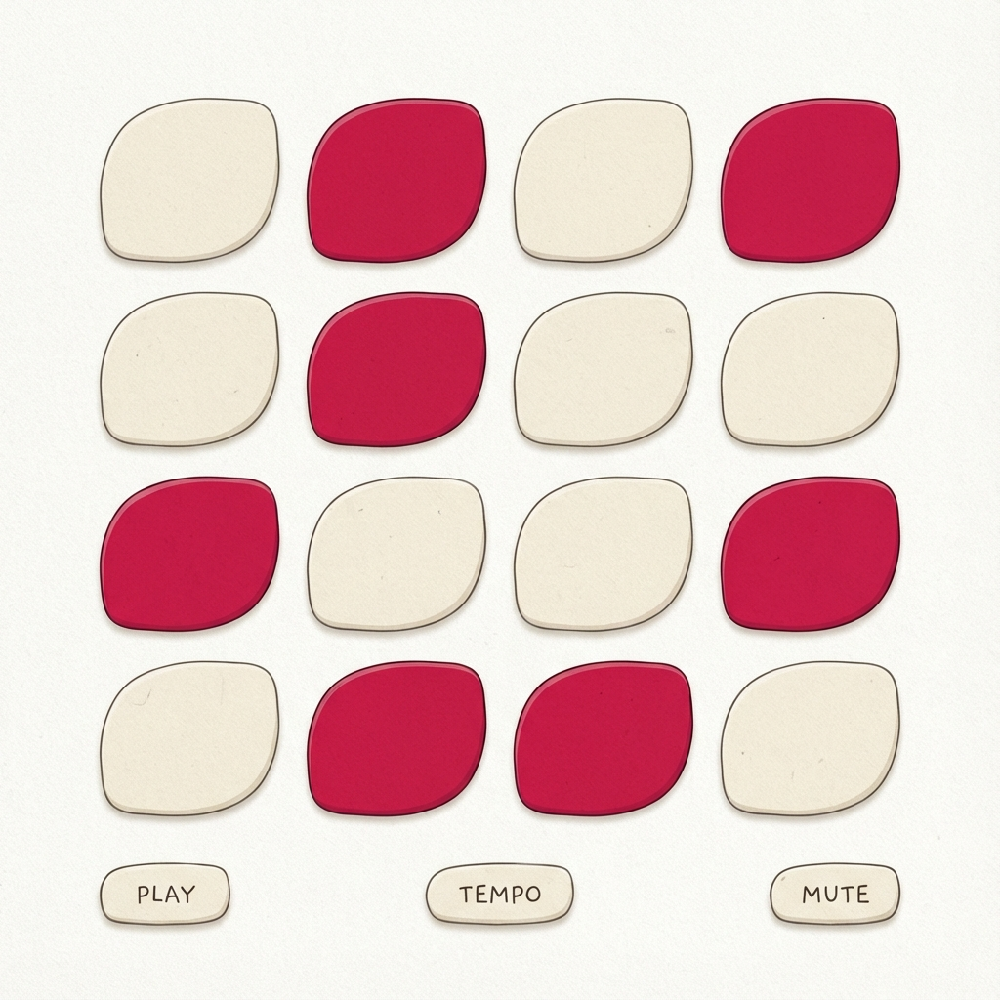

# Design Specification: Beeter Components

**Status:** Draft
**Date:** 2025-11-28
**Author:** UI/UX Designer Agent

## 1. Overview
This specification details the visual components for Beeter, implementing the "Organic Precision" framework.



## 2. The Garden Grid (Sequencer)
The core interface. A 16-step matrix representing the "Bed" where musical "Seeds" are planted.

### Visual Style
*   **Container**: Soft rounded rectangle (`border-radius: 12px`), background `#F0F0F0` (Light) / `#3A3030` (Dark).
*   **Step (Inactive)**:
    *   Shape: Circle or Squircle (`border-radius: 40%`).
    *   Color: `#E0E0E0` (Light) / `#4A4040` (Dark).
    *   Border: None.
    *   Shadow: Inner shadow (inset) to look like a divot in the soil.
*   **Step (Active/Planted)**:
    *   Color: **Beet Red** `#D93846`.
    *   Shadow: Drop shadow (soft), making it look like a seed sitting *on top*.
    *   Animation: `transform: scale(1.1)` on activation (pop).
*   **Step (Parameter Locked)**:
    *   Indicator: A small **Turnip Purple** dot in the top-right corner.
*   **Playhead**:
    *   Style: A glowing border or a "Water" overlay that washes over the step.
    *   Color: **Stem Green** (low opacity).

## 3. The Control Knobs (Rotary)
Used for parameters like Filter Cutoff, Resonance, Decay.

### Visual Style
*   **Shape**: Round, with a clear indicator line.
*   **Track**: Background ring in **Stone Grey**.
*   **Fill**: Active arc in **Beet Red**.
*   **Interaction**:
    *   Infinite rotation (if relative) or 270-degree (if absolute).
    *   Cursor: `ns-resize` (vertical drag).
    *   Feedback: Tooltip appears on drag showing exact value.

## 4. The Code Editor (The "Soil")
Where the algorithmic roots live.

### Visual Style
*   **Placement**: Slide-over panel (mobile) or Split View (desktop).
*   **Background**: **Loam Dark** `#2C2424` (even in Light Mode, for contrast).
*   **Font**: `JetBrains Mono`, 14px.
*   **Syntax Highlighting**:
    *   Functions (`sound`, `note`): **Stem Green**.
    *   Values (`"bd"`, `0.5`): **Golden Root**.
    *   Modifiers (`fast`, `slow`): **Turnip Purple**.

## 5. Layout Structure

### Desktop (Landscape)
```
+--------------------------------------------------+
|  Header (Logo, Transport, BPM, Collab Avatars)   |
+----------------------+---------------------------+
|                      |                           |
|  Track List (Rows)   |    Code Editor (Panel)    |
|  [Kick ] [Grid....]  |                           |
|  [Snare] [Grid....]  |    s("bd*4")              |
|  [HiHat] [Grid....]  |    .fast(2)               |
|                      |                           |
+----------------------+---------------------------+
|  Inspector / Knobs (Bottom Bar)                  |
+--------------------------------------------------+
```

### Mobile (Portrait)
*   **Top**: Transport & BPM.
*   **Middle**: Single Track View (swipe to change tracks).
*   **Bottom**: Knobs (scrollable).
*   **Floating Action Button**: Toggle Code View.

## 6. Assets Required
*   **Icons**: Play, Stop, Record, Settings, Share (Feather Icons or similar clean set).
*   **Logo**: A stylized Beet root (simple vector).
*   **Sound Pack**: "Organic" drum samples (dry, crisp) to match the visual tone.
