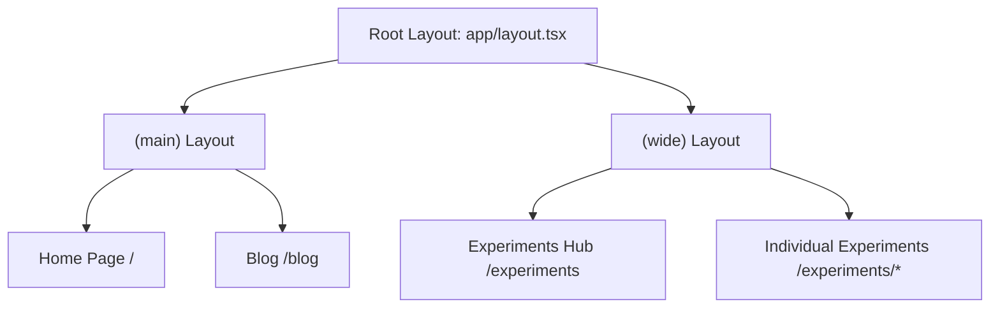

# Architecture Decision Record (ADR)

**Title:** Experiments Hub Layout Architecture  
**Status:** Proposed  
**Date:** 2025-12-06  
**Author(s):** Architect  
**Related PRD:** [prd_experiments_hub.md](./prd_experiments_hub.md)

---

## Context

The Experiments Hub feature (see PRD) requires:

1. A new `/experiments` hub page accessible from the main navigation.
2. Individual experiment pages with **independent layouts** not constrained by the root layout's `max-w-xl` container.
3. Seamless integration with existing build/test/deploy tooling.
4. Support for rapid iteration on multiple experiments in parallel.

### Current Architecture

```
app/
├── layout.tsx          # Root layout: <body className="max-w-xl mx-auto">
├── page.tsx            # Home page
├── blog/               # Blog section (inherits root layout)
├── components/         # Shared components (Navbar, Footer, etc.)
└── config/nav.ts       # Navigation configuration
```

The root layout in `app/layout.tsx` applies:
- Constrained container: `max-w-xl mx-4 mt-8 lg:mx-auto`
- Shared Navbar & Footer
- Global metadata and structured data

**Problem:** All routes inherit this constrained layout. Experiments need **full-width, custom layouts** without these constraints.

---

## Decision

**Use Next.js Route Groups with a Parallel Layout Strategy**

We will implement a **Route Group architecture** using Next.js App Router conventions:

### 1. Route Group Structure

```
app/
├── (main)/                    # Route group for base site
│   ├── layout.tsx            # Constrained layout (move from root)
│   ├── page.tsx              # Home page
│   └── blog/                 # Blog section
│
├── (wide)/                    # Route group for experiments
│   ├── layout.tsx            # Minimal wide layout
│   └── experiments/          # Experiments hub and sub-pages
│       ├── page.tsx          # Hub index page
│       └── [experiment]/     # Individual experiments
│           └── page.tsx
│
├── layout.tsx                # Root layout (fonts, global CSS, HTML)
├── global.css
└── components/
```

### 2. Layout Hierarchy



### 3. Layout Responsibilities

| Layout | Responsibility |
|:---|:---|
| **Root Layout** (`app/layout.tsx`) | HTML, fonts, global CSS, `<html>` + `<body>` skeleton |
| **(main) Layout** (`app/(main)/layout.tsx`) | Navbar, Footer, constrained container (`max-w-xl`) |
| **(wide) Layout** (`app/(wide)/layout.tsx`) | Minimal wrapper, full-width, no constraints |

### 4. Navigation Update

Modify `app/config/nav.ts` to include the experiments link:

```typescript
export const navItems: Record<string, NavItem> = {
  '/': { name: 'home' },
  '/blog': { name: 'blog' },
  '/experiments': { name: 'experiments' }, // NEW
}
```

---

## Rationale

### Why Route Groups?

1. **Layout Independence**: Route groups `(folder)` do not affect URL structure. Pages in `(main)` and `(wide)` have clean URLs.
2. **Shared Root**: Both groups share the root layout for fonts, global styles, and `<html>` structure.
3. **Parallel Development**: Experiments in `(wide)` are isolated and can be developed independently.
4. **Next.js Native**: This is the recommended Next.js App Router pattern for layout variants.

### Why Not Nested Layouts?

Using nested layouts (`/experiments/layout.tsx`) would still inherit the root layout's constraints. We need to **bypass** the constrained layout entirely, which requires route groups.

### Why Not Separate Apps?

A separate Next.js app for experiments would:
- Duplicate dependencies and tooling
- Complicate deployment (two separate builds)
- Require cross-origin navigation

Route groups solve this with **zero overhead**.

---

## Alternatives Considered

### Option 1: Override Styles per Experiment

**Approach:** Keep single layout, use CSS classes to override constraints on experiment pages.

**Pros:**
- Minimal file changes

**Cons:**
- CSS overrides are fragile and hard to maintain
- Every experiment needs to "undo" the base layout
- Navbar/Footer still rendered (visual clutter or hidden)

**Verdict:** ❌ Rejected — does not provide true layout independence.

---

### Option 2: Dynamic Layout via Props

**Approach:** Pass layout variant to root layout via page props or metadata.

**Pros:**
- Single layout file

**Cons:**
- Complex conditional logic in layout
- Harder to reason about
- Not a standard Next.js pattern

**Verdict:** ❌ Rejected — adds complexity without benefit.

---

### Option 3: Route Groups (Selected)

**Approach:** Use `(main)` and `(wide)` route groups with separate layouts.

**Pros:**
- Clean separation of concerns
- Standard Next.js pattern
- No CSS hacks or conditional logic
- Easy to add new layout variants in the future

**Cons:**
- Requires reorganizing existing files
- Two layout files to maintain

**Verdict:** ✅ Selected — cleanest, most maintainable approach.

---

## Consequences

### Positive

1. **True Layout Independence**: Experiments have full control over their visual presentation.
2. **No URL Changes**: Route groups are invisible in URLs (`/experiments`, not `/(wide)/experiments`).
3. **Shared Utilities**: Both route groups share fonts, global CSS, and root layout.
4. **Code Splitting**: Experiments are automatically code-split from the main site.
5. **Standard Pattern**: Aligns with Next.js App Router best practices.
6. **Future-Proof**: Easy to add more layout variants (`(dashboard)`, `(landing)`, etc.).

### Negative

1. **File Reorganization**: Existing pages must be moved into `(main)` route group.
2. **Two Layout Files**: Slightly more files to maintain (minimal overhead).
3. **Migration Effort**: One-time refactoring required.

### Migration Path

1. Create `app/(main)/` and move existing content into it.
2. Create `app/(wide)/` for experiments.
3. Refactor root layout to only include shared HTML/fonts.
4. Create individual layouts for each route group.
5. Update navigation config.

---

## Implementation Plan (For Builder)

### Phase 1: Reorganize Existing Site

| Task | Files | Priority |
|:---|:---|:---|
| Create `(main)` route group | `app/(main)/` | P0 |
| Move home page | `app/page.tsx` → `app/(main)/page.tsx` | P0 |
| Move blog | `app/blog/` → `app/(main)/blog/` | P0 |
| Create `(main)` layout | `app/(main)/layout.tsx` | P0 |
| Refactor root layout | `app/layout.tsx` | P0 |

### Phase 2: Experiments Framework

| Task | Files | Priority |
|:---|:---|:---|
| Create `(wide)` route group | `app/(wide)/` | P0 |
| Create `(wide)` layout | `app/(wide)/layout.tsx` | P0 |
| Create experiments hub page | `app/(wide)/experiments/page.tsx` | P0 |
| Update navigation | `app/config/nav.ts` | P0 |
| Create sample experiment | `app/(wide)/experiments/sample/page.tsx` | P1 |

### Phase 3: Documentation & Tooling

| Task | Files | Priority |
|:---|:---|:---|
| Document experiment creation | `docs/creating-experiments.md` | P1 |
| Create experiment scaffold script | `scripts/new-experiment.sh` | P2 |

---

## References

- [Next.js Route Groups](https://nextjs.org/docs/app/building-your-application/routing/route-groups)
- [Next.js Layouts and Templates](https://nextjs.org/docs/app/building-your-application/routing/layouts-and-templates)
- [PRD: Experiments Hub](./prd_experiments_hub.md)

---

## Handoff

> **Next Step**: Hand off to **Builder** for implementation.
> 
> **Artifact Path**: `./artifacts/adr_experiments_layout.md`
