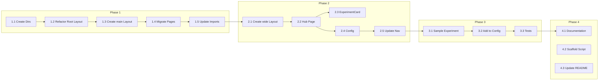

# Execution Roadmap: Experiments Hub

> **Project**: Experiments Hub Implementation  
> **Status**: Ready for Implementation  
> **Created**: 2025-12-06  
> **Artifacts**:  
> - [PRD: Experiments Hub](./prd_experiments_hub.md)  
> - [ADR: Experiments Layout](./adr_experiments_layout.md)

---

## Overview

This roadmap details the phased implementation of the Experiments Hub feature, enabling layout-independent experiments with seamless integration into the existing build/test/deploy pipeline.

---

## Phase 1: Site Reorganization 🏗️

**Goal**: Restructure existing site to use Route Groups without changing behavior.

**Owner**: Builder  
**Priority**: P0 (Critical Path)  
**Estimated Effort**: 2-3 hours

### Tasks

- [ ] **1.1 Create Route Group Directories**
  - Create `app/(main)/` directory
  - Create `app/(wide)/` directory

- [ ] **1.2 Refactor Root Layout**
  - Modify `app/layout.tsx` to contain only:
    - `<html>` and `<body>` skeleton
    - Font loading (GeistSans, GeistMono)
    - Global CSS import
    - Structured data
    - Meta tags (viewport, theme-color, security headers)
  - Remove Navbar, Footer, and constrained container (`max-w-xl`)

- [ ] **1.3 Create (main) Layout**
  - Create `app/(main)/layout.tsx` with:
    - Constrained container (`max-w-xl mx-4 mt-8 lg:mx-auto`)
    - `<Navbar />` component
    - `<Footer />` component
  - This layout restores the current site behavior for existing pages

- [ ] **1.4 Migrate Existing Pages**
  - Move `app/page.tsx` → `app/(main)/page.tsx`
  - Move `app/page.test.tsx` → `app/(main)/page.test.tsx`
  - Move `app/blog/` → `app/(main)/blog/`
  - Move `app/not-found.tsx` → `app/(main)/not-found.tsx`

- [ ] **1.5 Update Component Imports**
  - Verify all component imports still resolve correctly
  - Update any relative paths if needed

### Verification

```bash
# Run type checking
npm run type-check

# Run linting
npm run lint

# Run tests
npm run test:quick

# Build and verify
npm run build

# Preview locally
npx serve out
```

**Acceptance Criteria**:
- Site builds successfully
- All existing pages render identically
- No visual or functional regressions
- All tests pass

---

## Phase 2: Experiments Framework 🧪

**Goal**: Create the experiments infrastructure and hub page.

**Owner**: Builder  
**Priority**: P0 (Critical Path)  
**Estimated Effort**: 1-2 hours

### Tasks

- [ ] **2.1 Create (wide) Layout**
  - Create `app/(wide)/layout.tsx` with:
    - Minimal wrapper (full-width, no constraints)
    - Optional: back link to main site
    - Access to fonts and global CSS (inherited from root)

- [ ] **2.2 Create Experiments Hub Page**
  - Create `app/(wide)/experiments/page.tsx`
  - Include:
    - Page title and description
    - Grid/list for experiment cards
    - Empty state for when no experiments exist

- [ ] **2.3 Create Experiment Card Component**
  - Create `app/(wide)/experiments/components/ExperimentCard.tsx`
  - Props: title, description, href, (optional: thumbnail)
  - Hover effects and visual appeal

- [ ] **2.4 Create Experiments Configuration**
  - Create `app/(wide)/experiments/config.ts`
  - Export array of experiment metadata:
    ```typescript
    export interface Experiment {
      slug: string
      title: string
      description: string
      status: 'active' | 'coming-soon' | 'archived'
    }
    export const experiments: Experiment[] = []
    ```

- [ ] **2.5 Update Navigation**
  - Modify `app/config/nav.ts`:
    ```typescript
    export const navItems: Record<string, NavItem> = {
      '/': { name: 'home' },
      '/blog': { name: 'blog' },
      '/experiments': { name: 'experiments' },
    }
    ```

### Verification

```bash
# Type check
npm run type-check

# Lint
npm run lint

# Build
npm run build

# Manual verification
# - Navigate to /experiments from header
# - Verify full-width layout
# - Verify no Navbar/Footer on experiments pages
```

**Acceptance Criteria**:
- `/experiments` is accessible from navigation
- Hub page displays correctly with full-width layout
- No base layout constraints on experiments pages

---

## Phase 3: Sample Experiment 🎨

**Goal**: Create a sample experiment to validate the framework.

**Owner**: Builder  
**Priority**: P1 (Important)  
**Estimated Effort**: 30 min - 1 hour

### Tasks

- [ ] **3.1 Create Sample Experiment**
  - Create `app/(wide)/experiments/sample/page.tsx`
  - Demonstrate:
    - Full-width layout capability
    - Custom styling
    - Interactive elements

- [ ] **3.2 Add to Experiments Config**
  - Add sample experiment to `config.ts`:
    ```typescript
    export const experiments: Experiment[] = [
      {
        slug: 'sample',
        title: 'Sample Experiment',
        description: 'A demonstration of the experiments framework.',
        status: 'active',
      },
    ]
    ```

- [ ] **3.3 Create Experiment Tests**
  - Create `app/(wide)/experiments/sample/page.test.tsx`
  - Test rendering and basic interactions

### Verification

```bash
# Run tests
npm run test:quick

# E2E test (optional)
npm run test:e2e

# Build and preview
npm run preview
```

**Acceptance Criteria**:
- Sample experiment is visible on hub page
- Clicking sample experiment navigates to `/experiments/sample`
- Sample experiment renders with custom, full-width layout
- Tests pass

---

## Phase 4: Documentation & Tooling 📚

**Goal**: Enable rapid creation of new experiments.

**Owner**: Builder / Product Manager  
**Priority**: P2 (Nice to Have)  
**Estimated Effort**: 1 hour

### Tasks

- [ ] **4.1 Create Developer Documentation**
  - Create `docs/creating-experiments.md`
  - Include:
    - Overview of experiments framework
    - Step-by-step guide to create a new experiment
    - File structure conventions
    - Testing requirements
    - Deployment notes

- [ ] **4.2 Create Experiment Scaffold Script (Optional)**
  - Create `scripts/new-experiment.sh`
  - Auto-generates directory structure and boilerplate:
    ```bash
    ./scripts/new-experiment.sh my-cool-experiment
    # Creates:
    # - app/(wide)/experiments/my-cool-experiment/page.tsx
    # - app/(wide)/experiments/my-cool-experiment/page.test.tsx
    # - Updates config.ts
    ```

- [ ] **4.3 Update README**
  - Add section about experiments framework
  - Link to documentation

### Verification

- Documentation is clear and complete
- Scaffold script works (if implemented)
- New experiment can be created in < 15 minutes

---

## File Structure (Final State)

```
app/
├── layout.tsx                          # Root: fonts, global CSS, HTML skeleton
├── global.css
├── components/
│   ├── nav.tsx
│   ├── footer.tsx
│   └── ...
├── config/
│   └── nav.ts                          # Updated with /experiments
│
├── (main)/                             # Route group: constrained layout
│   ├── layout.tsx                      # Navbar, Footer, max-w-xl container
│   ├── page.tsx                        # Home
│   ├── page.test.tsx
│   ├── not-found.tsx
│   └── blog/
│       └── ...
│
└── (wide)/                             # Route group: full-width layout
    ├── layout.tsx                      # Minimal wrapper
    └── experiments/
        ├── page.tsx                    # Hub index
        ├── config.ts                   # Experiment registry
        ├── components/
        │   └── ExperimentCard.tsx
        └── sample/                     # Sample experiment
            ├── page.tsx
            └── page.test.tsx
```

---

## Dependency Graph



---

## Risk Assessment

| Risk | Likelihood | Impact | Mitigation |
|:---|:---|:---|:---|
| Breaking existing pages during migration | Medium | High | Run full test suite after Phase 1 |
| CSS conflicts between route groups | Low | Medium | Both groups share global CSS; test thoroughly |
| Build errors with static export | Low | High | Verify `output: 'export'` compatibility early |
| Navigation not working | Low | Medium | Manual E2E testing of all nav links |

---

## Success Criteria

| Criterion | Measurement |
|:---|:---|
| Site functionality preserved | All existing tests pass |
| Experiments layout independence | `/experiments/*` does not show base Navbar/Footer |
| Build pipeline works | `npm run build` succeeds |
| Developer experience | New experiment created in < 15 min |

---

## Handoff

> **Ready for**: Builder implementation  
> **Blocking artifacts**: None (PRD and ADR complete)  
> **First task**: Phase 1.1 - Create Route Group Directories

---

*This roadmap should be updated as implementation progresses. Mark tasks as complete and note any deviations or learnings.*
