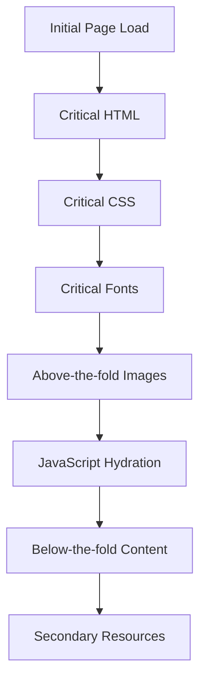

# Architecture Guide

This document provides a comprehensive overview of the Bidwell Consulting codebase architecture, design decisions, and system philosophy.

## System Overview

**Bidwell Consulting** is a production-ready, enterprise-level Next.js 15 portfolio website showcasing software engineering expertise and organizational consulting services. This codebase serves as both a functional business website and a demonstration of modern web development best practices.

## Architecture Principles

### 1. Performance-First Design

Every architectural decision prioritizes **Core Web Vitals** and user experience:

- **Server-First Rendering**: Server components by default, client components only when necessary
- **Optimized Asset Loading**: Advanced font loading, image optimization, and resource preloading
- **Bundle Optimization**: Code splitting, tree shaking, and webpack optimizations
- **Real-Time Monitoring**: Continuous performance tracking and optimization

### 2. Security-by-Design

Multi-layered security approach integrated throughout the system:

- **Defense in Depth**: Content Security Policy, HSTS, rate limiting, input validation
- **API Security**: Rate limiting, proper error handling, security headers
- **Input Validation**: Zod schema validation for all user inputs
- **Secure Headers**: Comprehensive security header implementation

### 3. Test-Driven Development

Quality assurance built into the development process:

- **70% Coverage Requirement**: Enforced across all code metrics
- **Multiple Test Types**: Unit, integration, accessibility, performance, security
- **Automated Quality**: CI/CD pipeline with automated testing and quality checks
- **Test-First Development**: Tests written before implementation

### 4. Accessibility-First

Universal design principles throughout:

- **WCAG 2.1 AA Compliance**: Full accessibility compliance
- **Semantic HTML**: Proper HTML structure and ARIA labels
- **Keyboard Navigation**: Complete keyboard accessibility
- **Screen Reader Testing**: Tested with assistive technologies

## Technology Stack

### Core Framework

- **Next.js 15.3.2** with App Router - Modern React framework with server-side rendering
- **TypeScript 5.8.3** (strict mode) - Type safety and better developer experience
- **React 18** - UI library with concurrent features

### Styling & Design

- **Tailwind CSS v4.1.7** - Utility-first CSS framework
- **Geist Font Family** - Vercel's design system fonts (Sans & Mono)
- **Responsive Design** - Mobile-first approach with comprehensive breakpoints

### Development & Quality

- **Jest 29.7.0 + Testing Library** - Comprehensive testing framework
- **ESLint + Prettier** - Code quality and formatting
- **TypeScript Strict Mode** - Enhanced type safety

### Deployment & Monitoring

- **Vercel** (primary) - Optimized Next.js hosting
- **GitHub Pages** (static export) - Fallback hosting option
- **Vercel Analytics** - Performance and user behavior monitoring

## System Architecture

### Application Structure

```text
bidwell/
├── app/                          # Next.js App Router
│   ├── components/               # Reusable UI components
│   ├── comparison/               # Feature: Number comparison tool
│   ├── api/                      # API routes with security
│   │   ├── health/              # Health check endpoint
│   │   └── analytics/           # Performance metrics collection
│   ├── layout.tsx               # Root layout with metadata
│   ├── page.tsx                 # Homepage with SEO optimization
│   └── global.css               # Global styles + Tailwind
├── lib/                          # Utility libraries (CRITICAL)
│   ├── performance.ts           # Core Web Vitals optimization
│   ├── font-optimization.ts     # Advanced font loading strategies
│   ├── security.ts              # Security utilities & headers
│   ├── validation.ts            # Zod schemas for input validation
│   └── env.ts                   # Environment validation
├── __tests__/                    # Comprehensive test suite
│   ├── components/              # Component unit tests
│   ├── integration/             # Integration tests
│   ├── lib/                     # Library tests
│   └── utils/                   # Test utilities
└── types/                       # TypeScript definitions
```

### Component Architecture

#### Server Components (Default)

- **Purpose**: Server-side rendering for better performance
- **Use Cases**: Static content, data fetching, SEO optimization
- **Benefits**: Faster initial load, better SEO, reduced client bundle

#### Client Components (When Necessary)

- **Purpose**: Interactive features requiring browser APIs
- **Use Cases**: State management, user interactions, browser-specific features
- **Indicators**: `'use client'` directive at top of file

### Data Flow Architecture

#### Static Generation

- **Homepage**: Server-side generated with metadata optimization
- **Comparison Tool**: Interactive client-side functionality
- **API Routes**: Dynamic server endpoints with security

#### Performance Optimization Flow

1. **Font Loading**: Critical subset preloading → Full font loading
2. **Image Loading**: Responsive images → WebP/AVIF optimization
3. **Code Splitting**: Route-based → Component-based → Dynamic imports
4. **Resource Preloading**: Critical resources → Secondary resources

## Key Innovations

### 1. Advanced Font Optimization System (`lib/font-optimization.ts`)

Sophisticated font loading strategy that adapts to user conditions:

```typescript
// Critical font subset loading for above-the-fold content
// Adaptive strategies based on connection speed
// Layout shift prevention with size adjustments
// Font display strategies (swap, fallback, optional)
```

**Benefits:**

- Eliminates Flash of Unstyled Text (FOUT)
- Reduces Cumulative Layout Shift (CLS)
- Improves First Contentful Paint (FCP)

### 2. Performance Monitoring System (`lib/performance.ts`)

Comprehensive performance tracking and optimization:

```typescript
// Core Web Vitals tracking with proper thresholds
// Performance metrics collection and rating
// Resource preloading utilities
// Layout shift prevention techniques
```

**Metrics Tracked:**

- **LCP**: Largest Contentful Paint (≤ 2.5s target)
- **INP**: Interaction to Next Paint (≤ 200ms target)
- **CLS**: Cumulative Layout Shift (≤ 0.1 target)
- **FCP**: First Contentful Paint (≤ 1.8s target)
- **TTFB**: Time to First Byte (≤ 800ms target)

### 3. Security Framework (`lib/security.ts` + `middleware.ts`)

Multi-layered security implementation:

**Security Headers:**

```typescript
X-Content-Type-Options: nosniff
X-Frame-Options: DENY
X-XSS-Protection: 1; mode=block
Referrer-Policy: strict-origin-when-cross-origin
Strict-Transport-Security (HSTS)
Content-Security-Policy (CSP)
```

**API Security Features:**

- Rate limiting (10 requests/minute per IP)
- Input validation with Zod schemas
- Secure error handling
- IP-based client identification

### 4. Testing Architecture (`__tests__/`)

Comprehensive testing strategy covering all quality aspects:

**Test Types:**

- **Unit Tests**: Component and utility function testing
- **Integration Tests**: Full page rendering and user journeys
- **Accessibility Tests**: Automated WCAG compliance with jest-axe
- **Performance Tests**: Render performance and memory usage
- **Security Tests**: Input validation and vulnerability testing

**Coverage Requirements:**

- Minimum 70% across branches, functions, lines, statements
- Focus on business logic and user interactions
- Automated enforcement in CI/CD pipeline

## Design Decisions & Rationale

### Why Next.js 15 App Router?

**Benefits:**

- **Server-First Architecture**: Better performance with server components
- **Streaming**: Improved loading experience with React Suspense
- **Nested Layouts**: Better code organization and user experience
- **Type-Safe APIs**: Built-in TypeScript support for API routes

**Trade-offs:**

- Learning curve for App Router patterns
- More complex mental model than Pages Router
- Careful consideration needed for server vs client components

### Why TypeScript Strict Mode?

**Benefits:**

- **Type Safety**: Catch errors at compile time
- **Better DX**: Superior IDE support and autocomplete
- **Self-Documenting**: Types serve as living documentation
- **Refactoring Safety**: Confident refactoring with type checking

**Implementation:**

- No `any` types allowed
- Proper interface definitions for all props
- Comprehensive type coverage for utilities

### Why Tailwind CSS v4?

**Benefits:**

- **Performance**: Purged CSS for minimal bundle size
- **Consistency**: Design system constraints prevent inconsistencies
- **Developer Experience**: Utility-first approach for rapid development
- **Responsive Design**: Built-in mobile-first responsive utilities

**Configuration:**

- Custom design tokens for brand consistency
- Dark mode support throughout
- Optimized purging for production builds

### Why Comprehensive Testing?

**Benefits:**

- **Quality Assurance**: Catch regressions before production
- **Living Documentation**: Tests document expected behavior
- **Confidence**: Safe refactoring and feature additions
- **Accessibility**: Automated compliance checking

**Implementation:**

- Test-Driven Development workflow
- Multiple test types for comprehensive coverage
- Automated quality gates in CI/CD

## Performance Optimization Strategy

### Critical Rendering Path

1. **HTML Structure**: Semantic HTML for fastest initial render
2. **Critical CSS**: Inline critical styles for above-the-fold content
3. **Font Loading**: Preload critical font subsets
4. **Image Optimization**: Responsive images with modern formats

### Loading Strategy



### Bundle Optimization

- **Code Splitting**: Automatic route-based splitting
- **Dynamic Imports**: Component-level code splitting
- **Tree Shaking**: Eliminate unused code
- **Webpack Optimization**: Custom webpack configuration

## Security Architecture

### Threat Model

**Primary Threats:**

- Cross-Site Scripting (XSS)
- Cross-Site Request Forgery (CSRF)
- Injection attacks
- Data exposure
- DDoS attacks

### Security Controls

**Input Validation:**

```typescript
// All user inputs validated with Zod schemas
const UserInputSchema = z.object({
  email: z.string().email(),
  message: z.string().min(1).max(1000),
})
```

**Rate Limiting:**

```typescript
// API endpoints protected with rate limiting
const rateLimit = createRateLimit(10, 60 * 1000) // 10 req/min
```

**Security Headers:**

```typescript
// Comprehensive security headers on all responses
headers: getSecurityHeaders()
```

## Monitoring & Observability

### Performance Monitoring

- **Real-User Monitoring**: Vercel Speed Insights
- **Core Web Vitals**: Continuous tracking
- **Custom Metrics**: Application-specific measurements
- **Error Tracking**: Built-in error boundaries

### Quality Monitoring

- **Test Coverage**: Automated coverage reporting
- **TypeScript Compliance**: Strict mode enforcement
- **Code Quality**: ESLint and Prettier automation
- **Security Scanning**: Dependency vulnerability checks

## Scalability Considerations

### Current Scale

- **Static Content**: Optimized for CDN delivery
- **API Endpoints**: Serverless functions with rate limiting
- **Database**: Stateless design, no database currently required
- **Caching**: Browser caching and CDN optimization

### Future Scaling

**Horizontal Scaling:**

- Serverless architecture naturally scales
- CDN distribution for global performance
- Static generation reduces server load

**Performance Scaling:**

- Code splitting for larger applications
- Micro-frontend architecture potential
- Database integration when data requirements grow

## Maintenance & Evolution

### Technical Debt Management

- **Regular Dependency Updates**: Automated security patches
- **Code Quality Monitoring**: Continuous quality metrics
- **Performance Monitoring**: Regular performance audits
- **Accessibility Auditing**: Periodic compliance reviews

### Future Enhancements

**Potential Improvements:**

1. **Internationalization**: i18n support for multiple languages
2. **CMS Integration**: Headless CMS for content management
3. **Advanced Analytics**: Custom event tracking and user behavior
4. **PWA Features**: Service worker, offline support, push notifications
5. **E2E Testing**: Playwright or Cypress for end-to-end testing

## Conclusion

This architecture demonstrates production-ready, enterprise-level web development with:

- **Performance Excellence**: Core Web Vitals optimization at every level
- **Security Hardening**: Multiple layers of security protection
- **Quality Assurance**: Comprehensive testing and quality gates
- **Developer Experience**: Modern tooling and clear patterns
- **Accessibility**: Universal design principles throughout
- **Maintainability**: Clean code, proper typing, comprehensive documentation

The system serves as both a functional business website and a showcase of modern web development best practices, suitable for use as a template for similar enterprise applications.

---

**Related Documentation:**

- [Getting Started Guide](./getting-started.md) - Complete onboarding tutorial
- [API Reference](./reference.md) - Technical reference documentation
- [Development Guide](../DEVELOPMENT.md) - Development workflows and patterns
- [Contributing Guidelines](../CONTRIBUTING.md) - Contribution process and standards
